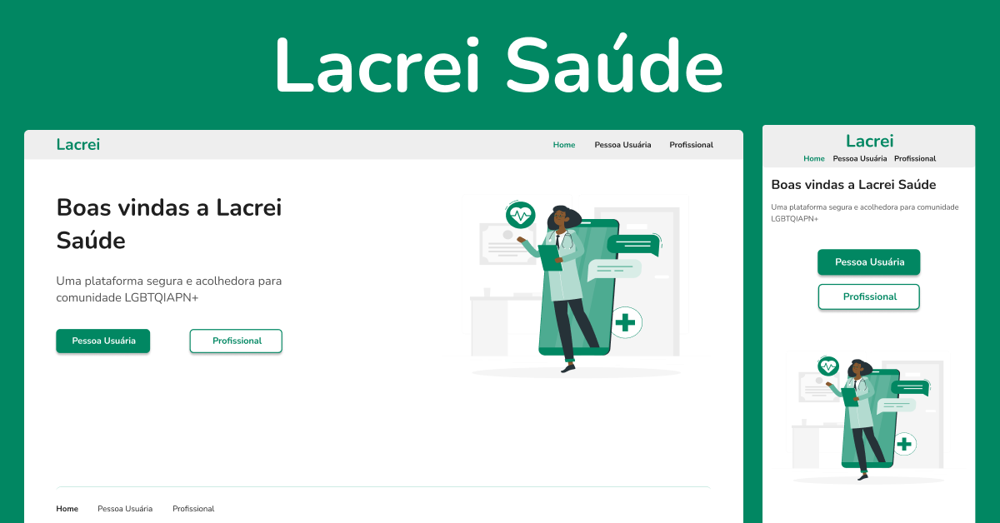

<div align="center" id="top">
  

&#xa0;

</div>

<h1 align="center">Lacrei Saúde 
</h1>

<!-- <h4 align="center">
	🚧   Under construction...  🚧
</h4> -->
<!-- <hr> -->

<p align="center">
  <a href="#-sobre">Sobre</a> &#xa0; | &#xa0;
  <a href="#-paginas">Páginas</a> &#xa0; | &#xa0;
  <a href="#-as-atividades-do-projeto">Atividades do projeto</a> &#xa0; | &#xa0;
  <a href="#-os-objetivos-do-projeto">Objetivos do projeto</a> &#xa0; | &#xa0;
  <a href="#-links">Links</a> &#xa0; | &#xa0;
  <a href="#-tecnologias">Tecnologias</a> &#xa0; | &#xa0;
  <a href="#-requisitos-para-rodar-a-aplicação">Requisitos</a> &#xa0; | &#xa0;
  <a href="https://github.com/joaotelesk" target="_blank">Autor</a>
</p>

<br>

## 🧠 Sobre

O projeto é um desafio técnico do processo seletivo da empresa Lacrei, para a vaga de Desenvolvedor Front End - Voluntário.

<br>

## 📖 Paginas

- Home
- Pessoas Usuárias
- Profissional

  <br>

## 🕹 As atividades do projeto:

- Desenvolver o projeto com base no layout e nos requisitos propostos.

  <br>

## 🏆 Os objetivos do projeto:

- Replicar layout de acordo com figma
- Executar navegação entre as telas
- Fazer deploy da aplicação
- Entregar uma aplicação responsiva

<!-- ### Os resultados do projeto: -->

 <br>

## 🔗 Links:

- [Site](-)
- [Github](https://github.com/joaotelesk/)
- [Figma](<https://www.figma.com/file/hzkXv2SZtiUdyneq23dAc7/Desafio-(Copy)?t=4q2VHi8Xgbkj0NQ4-6>)

  <br/>

## 🚀 Tecnologias

Abaixo você poderá ter acesso às principais tecnologias usadas neste projeto

- [NextJS](https://nextjs.org/)
- [TypeScript](https://www.typescriptlang.org/)
- [Styled Component](https://tailwindcss.com/)

 <br/>

## ✅ Requisitos para rodar a aplicação

Antes de iniciar 🏁, você precisa ter [Git](https://git-scm.com) e [Node](https://nodejs.org/en/) instalado em seu sistema operacional.

<br/>

## 🏁 Iniciando

```bash
# Clone este projeto
$ git clone https://github.com/joaotelesk/lacrei-technicalTest
# Acesse
$ cd lacrei-technicalTest
# Instale as dependências
$ yarn
# Execute o projeto
$ yarn start
# O projeto será inicializado em <http://localhost:3000>
```

<br/>

Feito com 💜 por <a href="https://github.com/joaotelesk" target="_blank">João Teles</a>

&#xa0;

### Vamos nos conectar?

- [instagram](https://www.instagram.com/jaootelesk)
- [linkedin](www.linkedin.com/in/joaotelesk)
- [github](https://github.com/joaotelesk)

<br />
<br />
<a href="#top">Voltar ao topo</a>
